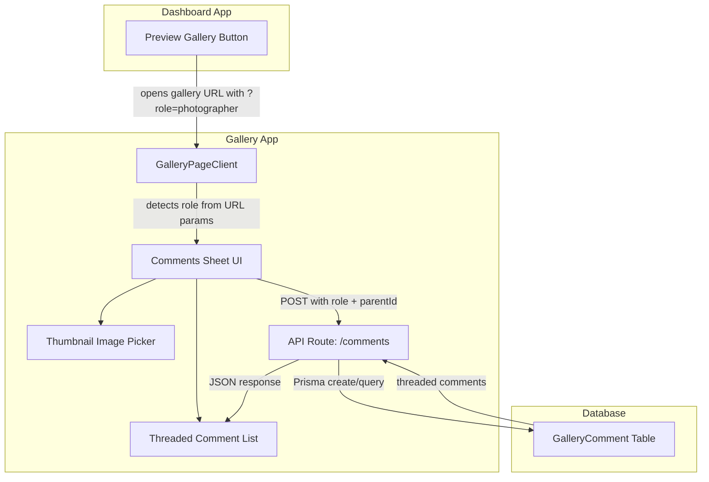

# Gallery Comments Redesign

## Current State

The comments system today is minimal:

- **Image selection**: A plain `<select>` dropdown showing "Image #1", "Image #2", etc. -- users have no visual way to identify which image they are referencing
- **Comment display**: Flat list, no threading, no replies
- **Author identity**: Hardcoded as `"Client"` for everyone -- no distinction between photographer and anonymous viewer
- **Storage**: In-memory runtime store (`gallery-runtime-store.ts`) -- comments are lost on server restart
- **No reply support**: No `parentId` or nesting mechanism exists

Key files:

- [apps/gallery/components/gallery/gallery-page-client.tsx](apps/gallery/components/gallery/gallery-page-client.tsx) -- main UI (lines 1152-1240 for comments sheet)
- [apps/gallery/app/api/gallery/[shareToken]/comments/route.ts](apps/gallery/app/api/gallery/[shareToken]/comments/route.ts) -- comments API
- [apps/gallery/lib/gallery-runtime-store.ts](apps/gallery/lib/gallery-runtime-store.ts) -- in-memory storage
- [apps/gallery/lib/gallery-types.ts](apps/gallery/lib/gallery-types.ts) -- type definitions

---

## Plan

### 1. Add `Comment` and `CommentReply` models to Prisma schema

In [packages/db/prisma/schema.prisma](packages/db/prisma/schema.prisma), add a `GalleryComment` model with nested reply support:

```prisma
model GalleryComment {
  id           String           @id @default(uuid())
  galleryId    String
  gallery      Gallery          @relation(fields: [galleryId], references: [id], onDelete: Cascade)
  photoId      String?
  photo        Photo?           @relation(fields: [photoId], references: [id], onDelete: SetNull)
  parentId     String?
  parent       GalleryComment?  @relation("CommentReplies", fields: [parentId], references: [id], onDelete: Cascade)
  replies      GalleryComment[] @relation("CommentReplies")
  authorName   String
  authorRole   String           @default("client") // "client" | "photographer"
  viewerId     String?
  message      String
  createdAt    DateTime         @default(now())
}
```

Run `pnpm prisma migrate dev` after.

### 2. Detect photographer vs client viewer

Currently the gallery page has no way to tell if the viewer is the photographer. The approach:

- **URL query parameter**: When the photographer clicks "Preview" or opens the share link from the dashboard, append a `?role=photographer` query param (or use a short-lived signed token). The gallery page reads this on mount.
- **Presence heartbeat**: The existing heartbeat (line 260-286 in `gallery-page-client.tsx`) already sends `role: "client"`. Change it to send the detected role.
- **Comment posting**: Pass the detected `role` and `viewerName` (photographer name from `gallery.photographer.name` or "Client") when posting comments.
- **Store role in state**: Add `viewerRole` state (`"client" | "photographer"`) to `GalleryPageClient`. Initialize from URL search params on mount.

### 3. Replace image selector with visual thumbnail grid picker

Replace the plain `<select>` dropdown (lines 1174-1185) with a scrollable horizontal thumbnail strip or a small grid popover:

- Show actual photo thumbnails (already available via `photo.thumbnailSrc`) in a horizontally scrollable row
- Each thumbnail is a small clickable card (~56x56px) with a selected state (ring/border highlight)
- Show the photo number overlay and `aiCaption` (if available) as a tooltip
- Include a "General" option (no photo) as the first item
- When a photo is clicked in the main grid, auto-select it in the comment form (this already partially works at line 984)

### 4. Redesign comment display with nested threading

Replace the flat comment list (lines 1203-1238) with a threaded view:

- **Top-level comments** render as cards (similar to current)
- Each comment shows a **Reply** button
- **Replies** are indented under their parent with a left border/line connector
- Replies show `authorName` with a role badge: "Photographer" (highlighted) or "Client"
- Support 1 level of nesting (replies to replies are flattened to the parent thread)
- When a comment references a photo, show a small inline thumbnail preview (clickable to open lightbox) instead of just "Mentioned image" text

### 5. Update the comments API to use Prisma + support replies

Update [apps/gallery/app/api/gallery/[shareToken]/comments/route.ts](apps/gallery/app/api/gallery/[shareToken]/comments/route.ts):

- **GET**: Query `GalleryComment` from DB with `include: { replies: true }`, filter by gallery's shareToken. Return threaded structure.
- **POST**: Accept `{ message, photoId?, parentId?, authorName, authorRole, viewerId }`. Create in DB. If `parentId` is provided, it is a reply.
- Resolve `galleryId` from `shareToken` via a Prisma lookup.

### 6. Update type definitions

In [apps/gallery/lib/gallery-types.ts](apps/gallery/lib/gallery-types.ts) and the client component, update `GalleryComment` type:

```typescript
type GalleryComment = {
  id: string;
  authorName: string;
  authorRole: "client" | "photographer";
  message: string;
  photoId: string | null;
  parentId: string | null;
  createdAt: string;
  replies: GalleryComment[];
  photo?: { thumbnailSrc: string } | null;
};
```

### 7. Remove in-memory comment storage

Remove comment-related code from [apps/gallery/lib/gallery-runtime-store.ts](apps/gallery/lib/gallery-runtime-store.ts) (keep viewer presence as-is since that is ephemeral by nature). The `addComment` and `listComments` functions will be replaced by direct Prisma calls in the API route.

### 8. UI polish for the comments sheet

- Add role badges next to author names (e.g., a small "Photographer" pill in primary color)
- Show the referenced photo as a small thumbnail inline in the comment card
- Add a "Reply" action button per comment
- When replying, show "Replying to [authorName]" indicator above the textarea with a cancel button
- Keep the comment sheet trigger button but add an unread count badge

---

## Data Flow




