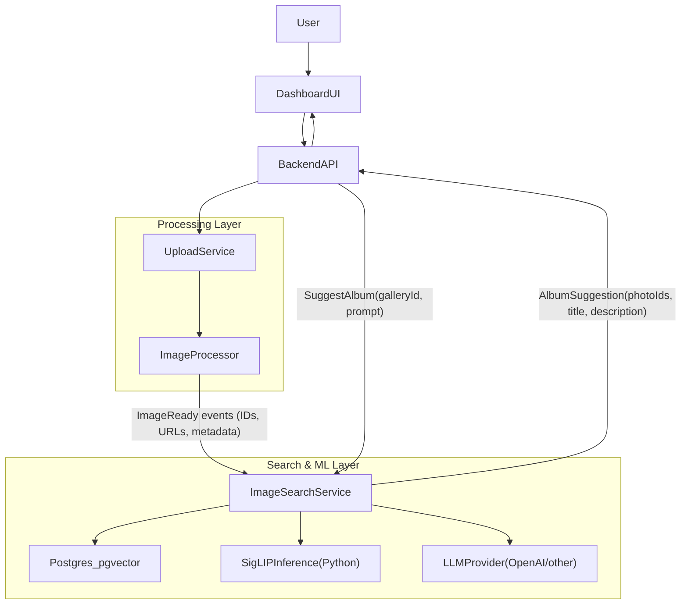

# SigLIP-based Image Search & Album Suggestion Plan

## Goals & constraints

- **Primary goal**: Given a user prompt and a gallery (≈2,000 photos), return a high-quality album suggestion (ordered photo IDs, optional title/description).
- **Core approach**:
  - Pre-compute **SigLIP** embeddings for all photos once per image version and store in **Postgres + pgvector**.
  - At query time, embed only the **text prompt**, run **vector search** over pre-computed image embeddings, and return matching photo IDs.
  - Optionally use an **LLM** only for album shaping (e.g. titling, light re-ranking), not for the heavy retrieval step.
- **Constraints**:
  - Handle galleries up to **2,000 photos** each; minimum target scale is **10k users** each prompting over such galleries.
  - **Cost-efficient**: avoid sending thousands of photos/tokens to LLMs; avoid recomputing image embeddings.
  - **Vendor-flexible**: able to start with OpenAI, but keep the design compatible with self-hosted components later.
  - **Language-agnostic service**: the core image-search API is protocol-defined (HTTP/JSON) so it can be implemented in **Node.js or Python**. SigLIP itself will be hosted in a small Python inference service.

---

## High-level architecture

### Components

- **ImageProcessor** (existing, Node):
  - Handles uploads, AI captions/tags, etc. (e.g. `[apps/image-processor/src/index.ts](apps/image-processor/src/index.ts)`).
  - Emits **image-ready events** containing `photoId`, URLs, and metadata when processing completes.
- **ImageSearchService** (new microservice, Node.js *or* Python):
  - Exposes ingestion and search APIs.
  - Stores image embeddings and metadata in **Postgres+pgvector**.
  - Calls **SigLIP Inference Service** for embeddings.
  - Optionally calls **LLM Provider** for album suggestion shaping.
- **SigLIP Inference Service** (new, Python):
  - Hosts `google/siglip-so400m-patch14-384` using Hugging Face `transformers`.
  - Provides `/embed-image` and `/embed-text` endpoints returning 1152‑dimensional vectors.
- **Postgres + pgvector**:
  - Stores per-photo metadata and embeddings.
  - Executes approximate nearest-neighbor search on embeddings.
- **Backend / Dashboard** (existing Node backend + frontend):
  - Backend currently has `suggestAlbum` in `[apps/backend/src/services/DashboardServices/suggestAlbum.ts](apps/backend/src/services/DashboardServices/suggestAlbum.ts)` using OpenAI directly.
  - Will be refactored to call `ImageSearchService` instead.

### System diagram

---

## Data model & storage (Postgres + pgvector)

- **Table**: `image_search_images` (schema name optional, e.g. `image_search.images`).
- **Columns**:
  - `id` (PK) – internal row ID.
  - `photo_id` – foreign key to main `photo` table ID.
  - `user_id` – owner (helps multi-tenant scoping).
  - `gallery_id` – gallery this photo belongs to.
  - `storage_url` – URL to original or mid-res image.
  - `thumbnail_url` – URL to thumbnail for UI.
  - `caption` – AI caption (copied from existing pipeline if available).
  - `tags` – small array of AI tags.
  - `metadata` JSONB – EXIF, location, people, etc.
  - `embedding` – `vector(1152)` using pgvector (SigLIP embedding size).
  - `indexed_at` – timestamp when embedding was last computed.
  - `version` – optional monotonically increasing integer for future re-embeddings.
- **Indexes**:
  - B-tree on `(gallery_id, user_id)` for scoping.
  - B-tree on `photo_id` for joins and upserts.
  - `pgvector` index on `embedding` (IVF/HNSW depending on pgvector version) tuned for fast ANN search.

Optional extra table for caching album prompts:

- **Table**: `image_search_album_cache`
  - `id` (PK)
  - `gallery_id`
  - `user_id`
  - `normalized_prompt` (e.g. lowercased, trimmed, maybe hashed).
  - `photo_ids` (array of UUIDs/strings) – ordered album result.
  - `album_title`, `album_description` – optional LLM-generated.
  - `created_at`, `expires_at` – TTL-based cache.

---

## SigLIP inference service (Python)

### Model choice

- Use **SigLIP**: `google/siglip-so400m-patch14-384` from Hugging Face.
- Both image and text encoders produce embeddings of size **1152**, which defines the pgvector dimension.

### API design

- `POST /embed-image`
  - Request: `{ "image_url": string }` **or** raw bytes upload; start with URL for simplicity.
  - Response: `{ "embedding": number[1152] }`.
- `POST /embed-text`
  - Request: `{ "text": string }`.
  - Response: `{ "embedding": number[1152] }`.

### Implementation notes

- Use FastAPI (or bare Starlette) + `transformers` + PyTorch.
- Load SigLIP model once at startup; keep it on GPU if available, CPU otherwise.
- Implement **batching** support:
  - Accept `texts: string[]` / `image_urls: string[]` and return list of embeddings.
  - ImageSearchService can batch ingestion for multiple photos.
- Configure sensible limits:
  - Max images per batch (e.g. 32–64) to balance latency vs throughput.
  - Timeouts and queueing to avoid overload.

---

## Ingestion & embedding pipeline

### Trigger from ImageProcessor

- When ImageProcessor finishes processing a photo, it sends a **single, idempotent event** to ImageSearchService:
  - Over HTTP (simplest): `POST /ingest-photo` on ImageSearchService.
  - Payload:
    - `photo_id`
    - `user_id`
    - `gallery_id`
    - `image_url`, `thumbnail_url`
    - `caption`, `tags`
    - any additional metadata.

### Ingestion endpoint in ImageSearchService

- `POST /ingest-photo`
  - Validates payload.
  - Checks if `photo_id` already exists; if so, 
    - Skip if `embedding` is present and `version` is unchanged.
    - Otherwise mark for re-embedding.
  - Enqueues embedding job to an internal **task queue** (in-memory or Redis/Rabbit, depending on infra).

### Embedding worker

- A worker process (same codebase as ImageSearchService) that:
  - Pulls embedding jobs (photo IDs) from the queue.
  - Batches jobs into groups up to N photos (e.g. 32).
  - For each batch:
    - Calls SigLIP `/embed-image` with the set of `image_url`s.
    - Persists embeddings + metadata to Postgres with **upsert** on `photo_id`.
  - Marks `indexed_at` and `version`.

### Initial backfill & incremental maintenance

- **Initial backfill**:
  - A one-off script lists all existing photos per gallery and enqueues them for embedding.
  - Throttle by gallery/user to avoid database and SigLIP saturation.
- **Incremental**:
  - New uploads go through the same ingestion path.
  - For deletions, either:
    - Soft-delete in `image_search_images` so search ignores them; or
    - Hard-delete rows when photos are removed from main DB.

---

## Query pipeline (search without LLM)

### API for backend

- `POST /search`
  - Request:
    - `user_id`
    - `gallery_id`
    - `prompt` (user text query)
    - `limit` (e.g. 50–200, default 50)
  - Response:
    - `photo_ids`: ordered list of photo IDs.
    - optional `scores` if you want similarity values.

### Steps

1. **Embed text prompt**
  - ImageSearchService calls SigLIP `/embed-text` once for the prompt.
2. **Vector search in Postgres**
  - Query `image_search_images` scoped by `gallery_id` (and `user_id` if needed).
  - Use cosine or inner product similarity with pgvector index to fetch top K (e.g. 200) images.
3. **Return top results**
  - Return only IDs (and optionally captions/thumbnails) to Backend.

### Cost characteristics

- **Per query** cost is dominated by:
  - One SigLIP text embedding call (cheap, fixed size 1152).
  - One Postgres vector search over ~2,000 rows (very cheap with pgvector index).
- **No LLM required** for retrieval itself, so this path is highly cost-efficient and naturally scales to 10k+ users.

---

## Query pipeline (album suggestion with optional LLM)

### API for backend

- `POST /suggest-album`
  - Request:
    - `user_id`
    - `gallery_id`
    - `prompt`
    - `album_size` (e.g. 40)
  - Response:
    - `photo_ids`: ordered final album IDs (size ≤ `album_size`).
    - `album_title`, `album_description` (optional strings, may be empty if LLM disabled).

### Baseline (no LLM, cheapest)

1. Call internal `/search` with `limit = album_size`.
2. Return those IDs directly.
3. Optionally synthesize a simple title based on the prompt (pure string handling, no LLM).

### Enhanced (LLM enabled but constrained)

1. Call `/search` with `limit = K` (e.g. 200) to get candidate photos.
2. Build a **compact textual representation** of each candidate:
  - `Photo ID`, short `caption` (truncated), short `tags`, maybe date & location.
3. Call the LLM with:
  - System message describing the task and required JSON output format.
  - User prompt including the user’s request and the candidate list.
4. LLM outputs:
  - A subset/reordering of candidate IDs.
  - Optional title/description.
5. Filter out any IDs not in the candidate list to guard against hallucinations.
6. Return final ordered IDs and metadata.

### Caching album suggestions

To avoid repeated LLM cost for the same prompt + gallery:

- Before calling the LLM, check `image_search_album_cache` for:
  - `(gallery_id, user_id, normalized_prompt)`.
- If found and `expires_at` is in the future, **return cached album**.
- If not found:
  - Run the LLM flow.
  - Store the result in the cache with `expires_at` (e.g. 24–72 hours) or an invalidation rule.

This ensures that frequently repeated prompts ("best of 2023", "family vacation", etc.) are cheap after the first call.

---

## Language choice & service boundaries

### SigLIP Inference Service (Python, fixed)

- Always Python, because it uses ML tooling that is more mature there.
- Exposes a stable HTTP API, independent of the language of ImageSearchService.

### ImageSearchService (Node.js or Python)

- Can be implemented in either language with the same external behavior:
  - HTTP endpoints: `/ingest-photo`, `/search`, `/suggest-album`.
  - Calls SigLIP HTTP API and Postgres + pgvector.
- **Node.js option**:
  - Reuse existing patterns from backend (OpenAI client, logging, error handling).
  - Use `pg` or Prisma with pgvector.
  - Simplifies integration with existing `suggestAlbum.ts` refactor.
- **Python option**:
  - Co-locate with SigLIP service code (all Python stack).
  - Use FastAPI + SQLAlchemy + pgvector bindings.

Because SigLIP and Postgres are network services, switching ImageSearchService implementation language later is feasible as long as the API contract is stable.

---

## Scalability & performance considerations

### Embedding throughput

- **One-time embedding per photo version**:
  - No per-query image embedding; only precomputed vectors are used.
- To handle many photos (e.g. 10k users × 2k photos = 20M photos worst-case over time):
  - Scale SigLIP service horizontally: multiple instances behind an internal load balancer.
  - Use batching in the worker so SigLIP processes 32–64 images at once.
  - Throttle backfill jobs per user/gallery to avoid sudden spikes.

### Query performance

- Each query does:
  - 1 text embedding via SigLIP – O(1) fixed cost.
  - 1 pgvector ANN query over rows scoped by `(user_id, gallery_id)` – typically a few thousand rows only.
- With appropriate indexes and hardware, you can easily hit **hundreds to thousands of QPS**.

### Memory & storage

- Each SigLIP embedding is 1152 floats.
  - With 4 bytes per float, that’s ≈ 4.6 KB/embedding.
  - For 2,000 photos: ≈ 9 MB of embedding data per gallery.
- For millions of images, storage remains manageable on typical Postgres setups, especially with compression and index tuning.

### Fault tolerance & retries

- Ingestion jobs should be idempotent: re-sending the same `photo_id` event only re-upserts the same row.
- Embedding worker should handle:
  - Temporary SigLIP failures (retry with backoff).
  - Postgres transient errors (retry-safe upserts).

---

## Cost control strategies

- **Avoid LLM for retrieval**: retrieval uses SigLIP + Postgres only.
- **Constrain LLM usage**:
  - Use LLM only for optional album titling/re-ranking.
  - Cap `K` (candidate size) for LLM input (e.g. 100–200).
  - Truncate captions/tags aggressively.
  - Use a small, cheap model (e.g. `gpt-4o-mini` or equivalent from other vendors).
- **Cache LLM results** in `image_search_album_cache`.
- **Pre-embed photos once**:
  - Treat embeddings as durable data; only recompute when you intentionally upgrade models.
- **Self-hosting readiness**:
  - SigLIP is already self-hosted.
  - LLM can be swapped to a self-hosted model later by only changing the LLM client in ImageSearchService.

---

## Phased implementation plan

### Phase 0 – Decisions & contracts

- Decide initial implementation language for ImageSearchService (Node or Python).
- Finalize HTTP contracts:
  - Between ImageProcessor and ImageSearchService: `/ingest-photo` payload.
  - Between Backend and ImageSearchService: `/search`, `/suggest-album`.
  - Between ImageSearchService and SigLIP service: `/embed-image`, `/embed-text`.
- Design DB schema for `image_search_images` and optional `image_search_album_cache`.

### Phase 1 – SigLIP inference service (Python)

- Set up a small FastAPI app with `/embed-image` and `/embed-text`.
- Integrate `google/siglip-so400m-patch14-384` via Hugging Face `transformers`.
- Implement batching and basic observability (logging, simple metrics, health checks).
- Package into Docker if you use containers.

### Phase 2 – ImageSearchService skeleton + Postgres schema

- Scaffold ImageSearchService in chosen language:
  - Basic project structure and config.
  - DB connection and migrations for `image_search_images`.
- Implement a minimal client for SigLIP service.
- Expose a simple `/health` endpoint and wire into your infra.

### Phase 3 – Ingestion & embedding pipeline

- Implement `/ingest-photo` in ImageSearchService.
- Add an internal embedding queue and worker:
  - Queue implementation (in-process or Redis/Rabbit-backed).
  - Worker that batches photos and calls SigLIP, then upserts into Postgres.
- Build tools for **initial backfill** of existing photos.
- Integrate ImageProcessor:
  - After processing completes, it calls `/ingest-photo` with required payload.

### Phase 4 – Search & album suggestion APIs

- Implement `/search`:
  - Accept prompt, `gallery_id`, `user_id`, `limit`.
  - Call SigLIP `/embed-text` and run pgvector search.
- Implement `/suggest-album` baseline (no LLM):
  - Wrap `/search` and trim to `album_size`.
- Integrate Backend:
  - Replace current logic in `suggestAlbum.ts` to call ImageSearchService `/suggest-album`.
  - Adapt dashboard UI to consume new response shape if necessary.

### Phase 5 – LLM-based album shaping & caching (optional)

- Implement LLM client in ImageSearchService.
- Extend `/suggest-album` to:
  - Check `image_search_album_cache` first.
  - If cache miss and LLM enabled, run the enhanced LLM re-ranking flow.
  - Store result in cache.
- Tune prompt and candidate size `K` for quality vs cost.

### Phase 6 – Observability, scaling, and hardening

- Add metrics and dashboards:
  - QPS, latency, error rates for ImageSearchService and SigLIP service.
  - Embedding queue depth and throughput.
  - LLM token usage and error rates.
- Load test the system with:
  - 2,000-photo galleries.
  - 10k concurrent users making search requests.
- Tune:
  - pgvector index parameters.
  - SigLIP batch size and concurrency.
  - LLM limits and caching policies.

---

## Summary

This plan:

- Uses **SigLIP** embeddings and **Postgres+pgvector** to provide fast, low-cost text-to-image retrieval.
- Treats the embedding and search layers as **precomputed and cached**, so each query only embeds text and hits pgvector.
- Keeps the architecture **language-agnostic** for the main service while fixing SigLIP as a small Python inference microservice.
- Provides clear phases so you can implement and test incrementally while staying ready for future, more advanced AI features.

