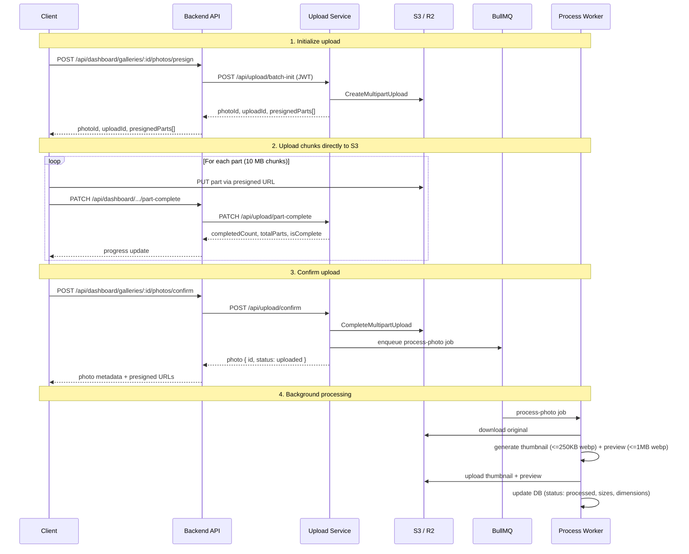

# Photo Upload & Processing Architecture

## Overview

Fotno uses a two-service architecture for photo uploads:

- **Backend API** (`apps/backend`) -- handles authentication, gallery/album management, and proxies upload requests to the upload-service.
- **Upload Service** (`apps/upload-service`) -- dedicated service for multipart S3 uploads, image processing, deduplication, storage accounting, and session management.

All upload operations go through the **dashboard API** on the backend, which delegates to the upload-service over HTTP using short-lived JWTs.

## Actors

| Actor | Description |
|---|---|
| **Client** | Dashboard web app (Next.js) |
| **Backend API** | Express server -- auth, routing, gallery CRUD |
| **Upload Service** | Express server -- multipart upload orchestration, processing workers |
| **Redis** | BullMQ job queues + session state |
| **S3 / R2** | Object storage for originals, thumbnails, previews |
| **PostgreSQL** | Photo, gallery, upload session, storage records |

## Upload Flow (end to end)



## API Endpoints

### Dashboard (Backend API)

All endpoints require authentication via `isAuth` middleware.

| Method | Path | Description |
|---|---|---|
| `POST` | `/api/dashboard/galleries/:id/photos/presign` | Initialize upload, get presigned part URLs |
| `GET` | `/api/dashboard/galleries/:id/photos/session` | Resume: list active upload sessions |
| `PATCH` | `/api/dashboard/galleries/:id/photos/part-complete` | Report a completed chunk |
| `POST` | `/api/dashboard/galleries/:id/photos/confirm` | Finalize upload, trigger processing |
| `PATCH` | `/api/dashboard/photos/:id` | Update photo (loved status) |
| `DELETE` | `/api/dashboard/photos/:id` | Delete photo + S3 cleanup |

### Upload Service (internal)

Called by the backend only; not exposed to clients directly.

| Method | Path | Description |
|---|---|---|
| `POST` | `/api/upload/batch-init` | Initialize multipart uploads for 1..500 files |
| `PATCH` | `/api/upload/part-complete` | Record a completed part |
| `POST` | `/api/upload/confirm` | Complete S3 multipart + enqueue processing |
| `POST` | `/api/upload/abort` | Abort upload + cleanup |
| `GET` | `/api/upload/session/:galleryId` | List active sessions with missing parts |

## S3 Key Structure

| Type | Pattern | Example |
|---|---|---|
| Original | `originals/{galleryId}/{photoId}/{filename}` | `originals/abc123/def456/photo.jpg` |
| Thumbnail | `thumbnails/{galleryId}/{photoId}.webp` | `thumbnails/abc123/def456.webp` |
| Preview | `previews/{galleryId}/{photoId}.webp` | `previews/abc123/def456.webp` |

## Processing Pipeline

The `process-photo` BullMQ worker in `apps/upload-service` handles all image processing:

1. Downloads the original from S3.
2. If RAW format (CR2, CR3, ARW, NEF, DNG, etc.), extracts an embedded JPEG preview via Sharp.
3. Compresses to **thumbnail** (max 250 KB, WebP) with iterative quality/size reduction.
4. Compresses to **preview** (max 1 MB, WebP) with iterative quality/size reduction.
5. Uploads both to S3 in parallel.
6. Updates the photo record: `status: processed`, thumbnail/preview keys, sizes, dimensions.
7. Updates storage accounting.

## Concurrency & Scaling

All tunables are environment variables (see `apps/upload-service/src/constants/env.ts`):

| Variable | Default | Description |
|---|---|---|
| `PROCESSOR_CONCURRENCY` | `8` | Photos processed in parallel per worker instance |
| `MAX_FILES_PER_BATCH` | `500` | Max files in a single batch-init request |
| `MAX_FILE_SIZE_BYTES` | `524288000` (500 MB) | Max size per uploaded file |
| `CHUNK_SIZE_BYTES` | `10485760` (10 MB) | Multipart chunk size |
| `UPLOAD_SESSION_TTL_HRS` | `24` | Hours before an incomplete session expires |
| `PRESIGNED_URL_TTL_SEC` | `7200` | Presigned URL validity (2 hours) |

### Horizontal scaling

Effective processing throughput = `PROCESSOR_CONCURRENCY` x number of upload-service worker instances.

To handle thousands of photos per second:

1. Run multiple upload-service instances (containers, K8s replicas, PM2 cluster).
2. All instances connect to the same Redis and PostgreSQL.
3. BullMQ distributes jobs automatically across workers.
4. Increase `PROCESSOR_CONCURRENCY` per instance if CPU/memory allow (8-16 is a good range for most machines).

### Cleanup

- **Expired sessions**: A recurring BullMQ job (`upload-cleanup`) runs hourly to abort stale multipart uploads and release reserved storage.
- **Storage reconciliation**: Runs daily at 03:00 to correct any drift between actual photo sizes and recorded storage usage.
- **Photo deletion**: When a user deletes a photo, the backend enqueues S3 key deletion via a separate cleanup queue (Bull).

## Photo Status Lifecycle

```
pending -> uploaded -> processing -> processed
                                  -> failed (retried up to 3 times)
```

- `pending`: Photo record created, multipart upload in progress.
- `uploaded`: All parts received, S3 multipart completed.
- `processing`: Worker is generating thumbnails/previews.
- `processed`: Ready for display in galleries.
- `failed`: Processing failed after retries; logged for investigation.
